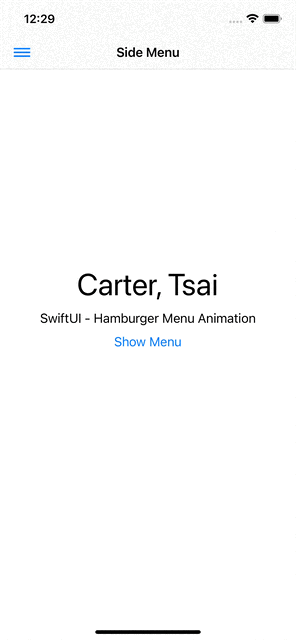

# SwiftUI - Hamburger Side Menu
<br />
<p align="center">
  <a>
    
  </a>
  <p align="center">
  </p>
</p>

## Features

- [x] Swipe to open/close the side bar
- [x] Blur effect for the bottom layer view

## Requirements

- iOS 13.0+
- SwiftUI

## Installation

There is no dependency for this app.

## Usage example

In the MenuView.swift file, modify each element's Image and the Text to customize your side menu.

```swift
    HStack {
        Image(systemName: "person")
            .foregroundColor(.gray)
            .imageScale(.large)
        Text("Profile")
            .foregroundColor(.gray)
            .font(.headline)
    }
```

## Acknowledgements
- This project was inspired and follow by [Youtube - BLCKBIRDS](https://www.youtube.com/channel/UCwzbe5mefpLX9hE9Q1AUPPw)


## Contact
Created by [@Hung-Chun, Tsai (Carter)](linkedin.com/in/hung-chun-carter-tsai-372584175) - feel free to contact me!

<div>

<i>Follow me around the web:</i><br>

<!-- <a target="_blank" href="https://www.linkedin.com/in/hung-chun-carter-tsai-372584175/">🇱​🇮​🇳​🇰​🇪​🇩​🇮​🇳​</a> ●
<a target="_blank" href="https://www.instagram.com/hungchun.tsai/">🇮​🇳​🇸​🇹​🇦​🇬​🇷​🇦​🇲​</a> ●
<a target="_blank" href="https://www.facebook.com/hongjun.cai.5">🇫​🇦​🇨​🇪​🇧​🇴​🇴​🇰​</a> ● -->

<a href="https://www.linkedin.com/in/hung-chun-carter-tsai-372584175/" target="_blank"></a>
<a href="https://www.instagram.com/hungchun.tsai/" target="_blank"></a>
<a href="https://www.facebook.com/hongjun.cai.5" target="_blank"></a>

</div>


